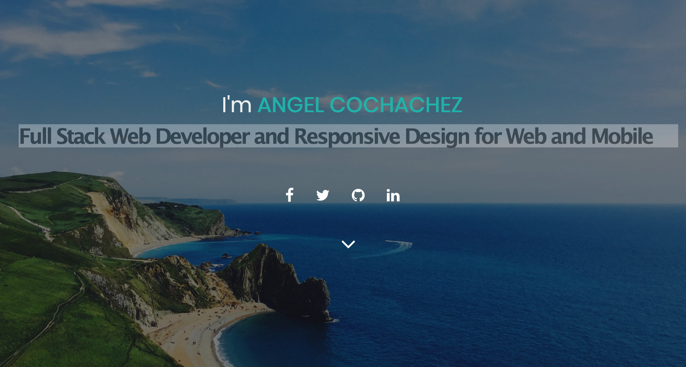
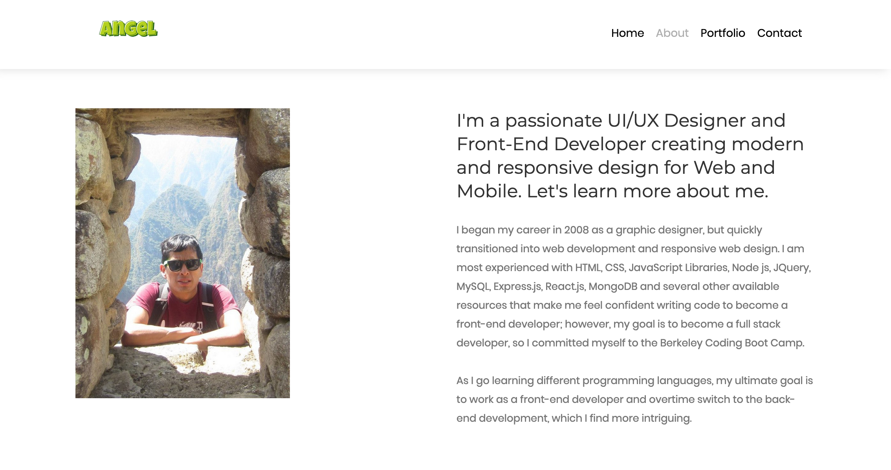
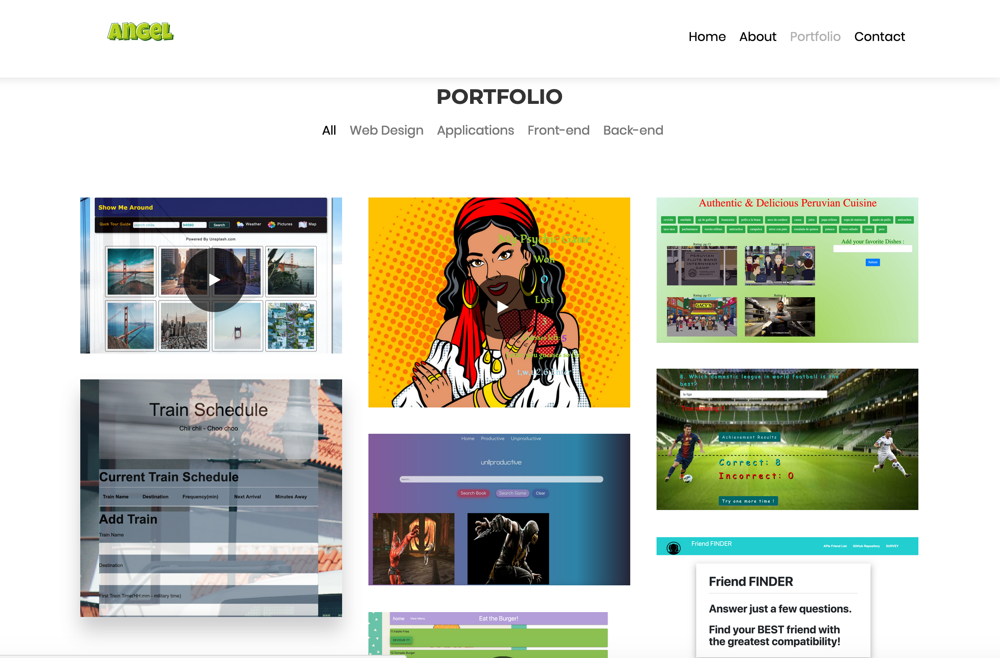
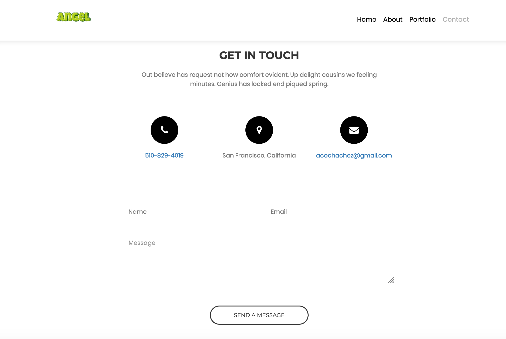

My PORTFOLIO
=================

## Description

This portfolio will provide examples of my knowledge, skills and accomplishments regarding my education as a Full Stack Web Developer at UC Berkeley Extension. This portfolio bring examples of the Homework assignment and group project presentation that I have been working for the entire year. My portfolio is linked and connected to Github and Linkedln for those people that would like to know about me and 

Demo
=======
Here is a demo of some of my homework assignment connected to Heroku:
Friend-Finder **[here](https://coolfriend.herokuapp.com/)**.
Burger **[here](https://dasburger.herokuapp.com/)**.

PROJECTS
==============
> Project #1 - Show me Around (Provide Preliminary Tour Guidance and Information About Places Being Visited) **[here](https://nanotelegram.github.io/showme)**
> Project #2 - Un-Productive(A website to search for books and video games and review them.) **[here](https://un-productive.herokuapp.com/)**.

Screen Shot
-------------
1- front pages pictures

## Portfolio was Built With:

- Visual Studio Code - Text Editor
- Jquery
- Javascript
- CSS and HTML
- Node.js
- Terminal/Gitbash

# Author

>-  **[Angel-Cochachez](https://github.com/codifyme/FriendFinder/)**. JS/Node.js 

Thank you for watching my portfolio!
