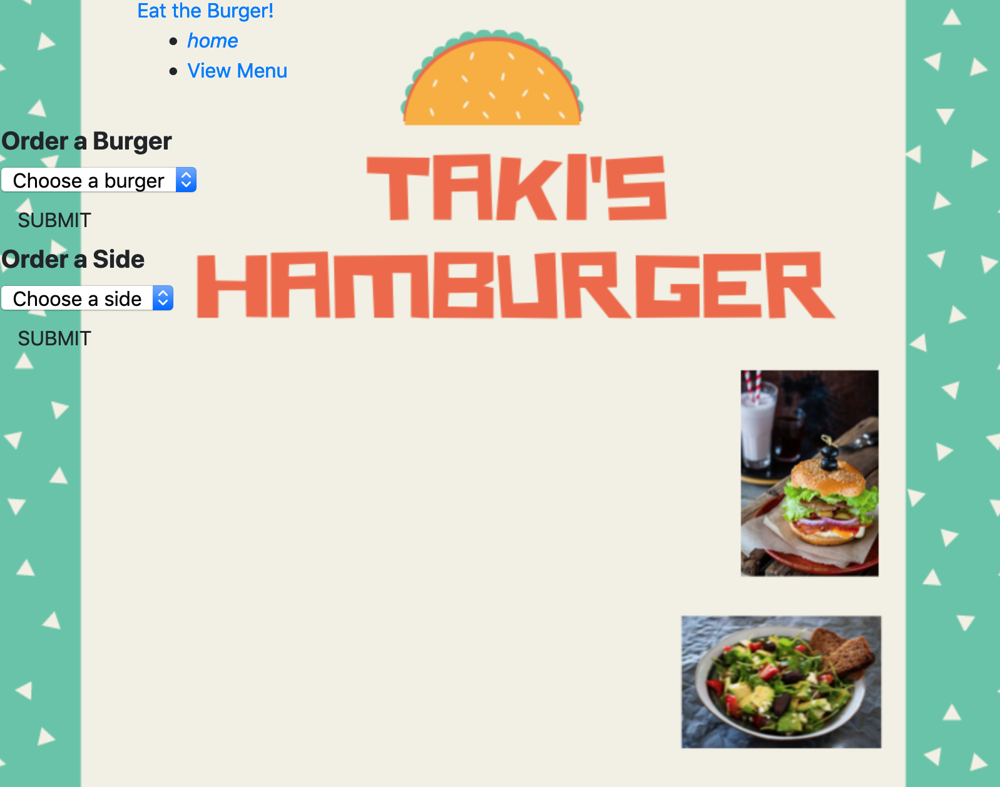

# BURGER
## Description
>Burger is a eating App builded with Node.js, Express, MySQL, Handlebars and Materialize. This application demostrate a simple >full stack application with front-end implemented with HTML/CSS and elements from the Materialized framework and backend >implemented with Node.js and Express. The HTML is done with the help of Handlebars.

# Demo
The burger demo eaiting application can be found in **[here](https://dasburger.herokuapp.com/).

# Technologies and Packages
1. npm init => initialize package.json
2. npm install => create package-lock.json
3. npm install => Install the npm express package
3. npm i inquirer => install **[inquirer package](https://www.npmjs.com/package/inquirer)**
4. npm i dotenv => install **[dotenv package](https://www.npmjs.com/package/dotenv)**

# Installation
to run the application locally, first clone this repository with the following command.
> git clone git@github.com:codifyme/burger.git

>next, install the application dependecies.
>cd burger
>npm install
>Finally, run it in your Visual Code editor 
>code .
>node server.js

Now, open the local App on port 3000 at your browser URL:
>http://localhost:3000/.
# Screen-shot
----------------
>Home Page - "Place your order"

>Dropdown Menu - "View the Menu"

# Build With
1. Visual Studio Code - Text Edito
2. Heroku
3. Node.js
4. Terminal/Gitbash

#Author
>- **[Angel-Cochachez](https://github.com/codifyme/FriendFinder/)**. JS/Node.js 

Have a nice day and enjoy your burger!
Thank 

